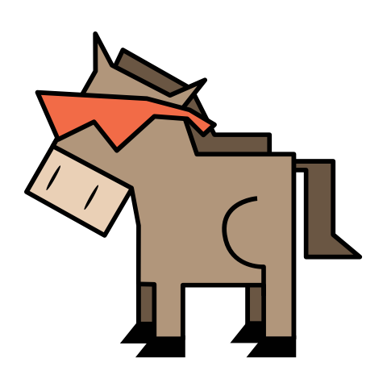

# Workhorse-UI API

> Quarkus wrapper for the REST-API used by Workhorse-UI

## Table of Contents


- [Install](#install)
- [Changelog](#changelog)
- [Maintainers](#maintainers)
- [Contribute](#contribute)
- [License](#license)
  


## Install

1. Add the following dependency to your project ([published on Maven Central](https://search.maven.org/artifact/io.coodoo/workhorse-ui-api-quarkus/))
   
   ```xml
   <dependency>
       <groupId>io.coodoo</groupId>
       <artifactId>workhorse-ui-api-quarkus</artifactId>
       <version>2.0.0-RC5-SNAPSHOT</version>
   </dependency>
   ```

## Changelog

All release changes can be viewed on our [changelog](./CHANGELOG.md).


## Maintainers

[coodoo](https://github.com/orgs/coodoo-io/people)


## Contribute

Pull requests and issues are welcome.


## License

[Apache-2.0 © coodoo GmbH](./LICENSE)

Logo: [Martin Bérubé](http://www.how-to-draw-funny-cartoons.com)
  